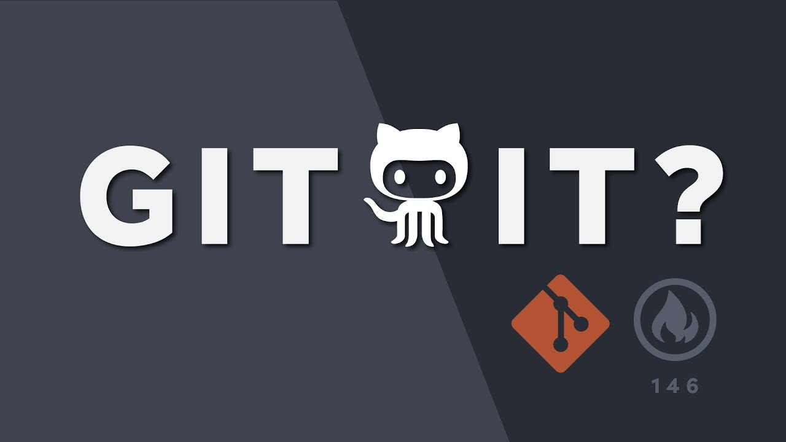

# 🔧 Git-Practice

> Repo học các lệnh Git và thao tác với GitHub từ cơ bản đến nâng cao.


---

## 📋 Table of contents

- [About](#-about)
- [Topics covered](#-topics-covered)
- [Getting started](#-getting-started)
- [Cheatsheet](#-cheatsheet)
- [Demo](#-demo)
- [Resources](#-resources)

---

## 📖 About

Đây là repo cá nhân dùng để luyện tập và ghi lại các câu lệnh Git, workflow thực tế khi làm việc với GitHub. Mục tiêu là nắm vững version control để áp dụng vào các dự án thực.

---

## 🗂 Topics covered

| Topic | Status | Notes |
|-------|--------|-------|
| `git init` / `git clone` | ✅ Done | Khởi tạo repo local và remote |
| `add` / `commit` | ✅ Done | Staging area, commit message |
| `push` / `pull` / `fetch` | ✅ Done | Đồng bộ với remote |
| `branch` / `merge` | 🔄 Learning | Feature branch workflow |
| `rebase` / `cherry-pick` | 📌 Todo | Advanced history editing |
| `stash` | 📌 Todo | Lưu tạm thay đổi chưa commit |
| Pull Request | 🔄 Learning | Review & merge trên GitHub |
| `.gitignore` | ✅ Done | Bỏ qua file không cần track |
| `git log` nâng cao | 🔄 Learning | Đọc lịch sử commit |

---

## 🚀 Getting started

### Yêu cầu

- Git >= 2.x — [Download](https://git-scm.com/downloads)
- Tài khoản GitHub

### Clone repo

```bash
# HTTPS
git clone https://github.com/username/git-practice.git

# SSH (khuyến nghị nếu đã setup SSH key)
git clone git@github.com:username/git-practice.git
```

### Cấu hình ban đầu (nếu chưa làm)

```bash
git config --global user.name "Tên của bạn"
git config --global user.email "email@example.com"

# Xem lại config
git config --list
```

---

## ⚡ Cheatsheet

### Workflow cơ bản

```bash
git status                    # Xem trạng thái các file
git add .                     # Stage tất cả thay đổi
git add <file>                # Stage một file cụ thể
git commit -m "feat: mô tả"   # Commit với message
git push origin main          # Push lên remote
```

### Branch

```bash
git switch -c feature/ten-tinh-nang   # Tạo branch mới và chuyển sang
git switch main                        # Quay về branch main
git branch -d feature/ten-tinh-nang   # Xoá branch sau khi merge
git branch -a                          # Xem tất cả branch (local + remote)
```

### Xem lịch sử

```bash
git log --oneline --graph --all   # Log dạng đẹp có cây branch
git log --author="Ten"            # Lọc theo tác giả
git diff HEAD~1                   # So sánh với commit trước
```

### Undo / Fix lỗi

```bash
git reset --soft HEAD~1    # Undo commit gần nhất, giữ lại thay đổi
git reset --hard HEAD~1    # Undo commit gần nhất, xoá luôn thay đổi
git restore <file>         # Huỷ thay đổi chưa stage của một file
git stash push -m "wip"    # Lưu tạm thay đổi chưa commit
git stash pop              # Lấy lại thay đổi đã stash
```

### Remote

```bash
git remote -v                        # Xem danh sách remote
git remote add origin <url>          # Thêm remote
git fetch origin                     # Tải về nhưng chưa merge
git pull --rebase origin main        # Pull và rebase thay vì merge
```

---

## 📸 Demo:
[](https://www.youtube.com/watch?v=HkdAHXoRtos&list=LL&index=1)

## 📚 Resources

- [Pro Git Book](https://git-scm.com/book/en/v2) — Tài liệu chính thức, miễn phí, rất chi tiết
- [Learn Git Branching](https://learngitbranching.js.org/) — Học interactive trực tuyến, có hình ảnh trực quan
- [GitHub Docs](https://docs.github.com) — Docs chính thức của GitHub
- [Conventional Commits](https://www.conventionalcommits.org/) — Quy ước viết commit message chuẩn

---

<p align="center">Made with 💙 while learning — feel free to fork and add your own notes</p>
